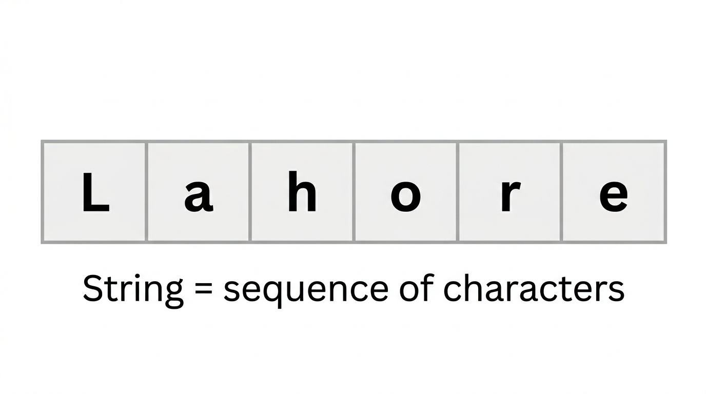
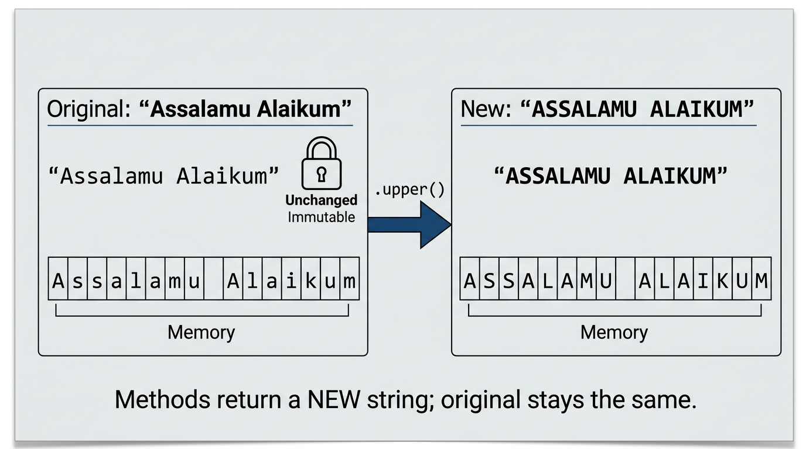
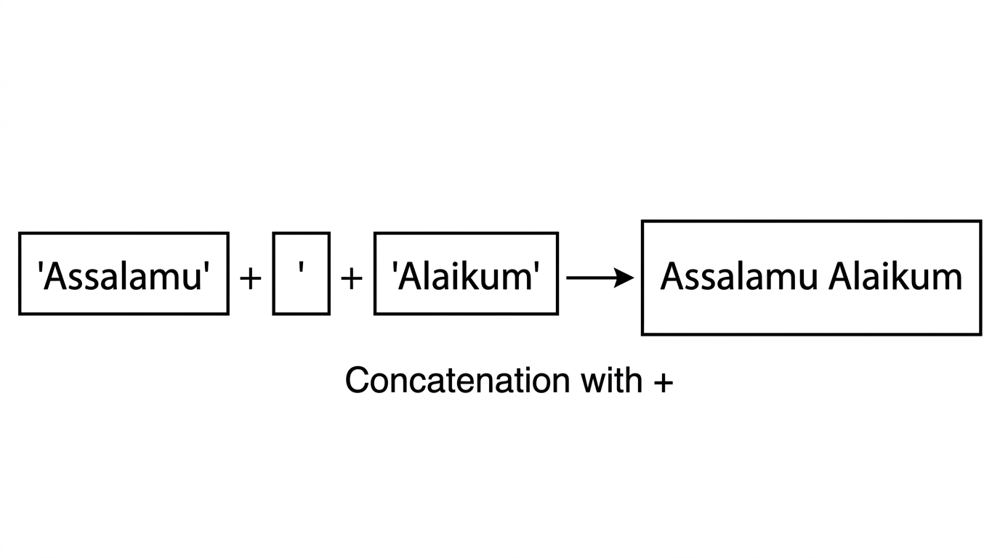
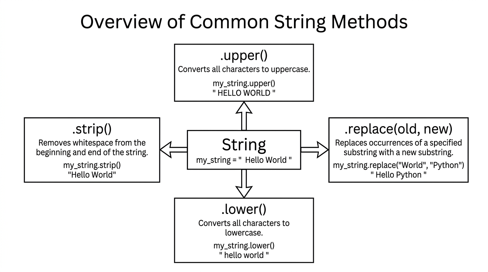

# Chapter: Strings in Python

---

## 1. Introduction: The Role of Strings in Programming

Programs often need to work with text. When we display a greeting, print the name of a city or a book, or show the name of an Islamic month, we are handling text. In Python, any such text is represented by a **String**. Strings are one of the most used types in programming.

Strings are used for:

- **Greetings and messages** — for example, "Assalamu Alaikum" or "Welcome to the class"
- **Names and labels** — cities like Lahore or Multan, names of books in a Maktaba, or a list of students in a Jamia
- **Dates and time** — names of Islamic months such as Ramadan and Shawwal, or Surah names
- **Formatted output** — building sentences by joining pieces of text together

In this chapter we focus on **string manipulation**: how to create strings, combine them, and change their appearance using built-in **String** **methods** (such as `.strip()`, `.upper()`, `.lower()`, `.replace()`, and others). We do not use variables; we work only with text and the operations we can perform on it.

Here are two simple examples. The first prints a greeting; the second prints the name of an institution.

```python
print("Assalamu Alaikum")
```

**Line 1:** The text in double quotes is a **String**. The `print` function displays it on the screen.

```python
print("Jamia Islamia Lahore")
```

**Line 1:** Again, the quoted text is a string. `print` sends it to the output.

---

## 2. Concept 1: Definition and Creation

### 2.1 What a String Is

A **String** is a **sequence of characters**. A character can be a letter (e.g. 'L', 'a'), a digit (e.g. '1', '2'), a space, or a symbol (e.g. '.', '!'). In Python, we do not separate “words” from “sentences”; both are strings. For example, `"Lahore"` is a string and so is `"We are learning Python."`



We use strings to:

1. **Display text** — using `print(...)`
2. **Build messages** — by joining strings together (concatenation)
3. **Change the way text looks** — using string methods (e.g. uppercase, lowercase, removing spaces)

An important property of strings in Python is **Immutability**. Once a string is created, its content cannot be changed in place. When we use a method like `.upper()` or `.replace()`, Python creates a **new** string; the original string stays the same.



### 2.2 Creating Strings and Concatenation

**Creating strings**

We create a string by enclosing the text in either single quotes (`'...'`) or double quotes (`"..."`). Use double quotes when the text contains an apostrophe (e.g. `"Let's start"`). Otherwise, single or double quotes are both fine.

**Printing string literals**

We pass a string directly to `print`:

```python
print("Assalamu Alaikum")
print("We are learning Python")
print("Jamia Islamia Lahore")
```

- **Line 1:** Prints the greeting.
- **Line 2:** Prints the sentence; the whole sentence is one string.
- **Line 3:** Prints the institution name.

**Concatenation**

We can join strings using the `+` operator. This is called **concatenation**. To add a space between words, we must include a string that contains a space (`" "`).



```python
print("Assalamu" + " " + "Alaikum")
print("Welcome" + " " + "dear" + " " + "students")
print("Maulana" + " " + "Abdul Rahman")
```

- **Line 1:** Three strings are concatenated: `"Assalamu"`, `" "`, and `"Alaikum"`. The result is `Assalamu Alaikum`.
- **Line 2:** Four strings are joined with spaces in between.
- **Line 3:** The title and name are joined with a space.

Another example: building a sentence with punctuation.

```python
print("Let's" + " " + "start" + " " + "our" + " " + "class" + "!")
```

The output is: `Let's start our class!`

**Concatenation with Urdu or Arabic text**

The same rules apply when the string contains Urdu or Arabic characters. We still use the `+` operator for **concatenation**, and we still use a string such as `" "` for spaces when needed.

```python
print("السلام" + " علیکم")
print("مولانا" + " " + "عبدالرحمن")
```

- **Line 1:** Two strings are concatenated.
- **Line 2:** The title and name are joined with a space. The technical terms remain **String** and **concatenation**.

### 2.3 The Length of a String

The number of characters in a string (including spaces) is given by the built-in function `len()`. We pass the string inside the parentheses. Because of **Immutability**, `len()` does not change the string; it only tells us how many characters it has.

**Concept:** `len()` returns an integer: the count of every character (letters, digits, spaces, symbols) in the string.

**Code:**

```python
print(len("Quran"))
print(len("Maulana Tariq Jameel"))
print(len("Assalamu Alaikum"))
```

- **Line 1:** `len("Quran")` returns `5` (Q, u, r, a, n).
- **Line 2:** `len("Maulana Tariq Jameel")` returns the total character count, including spaces.
- **Line 3:** `len("Assalamu Alaikum")` returns the length of the greeting.

---

## 3. Concept 2: String Methods

A **method** is an operation we call on a string using the dot: `string.method_name()`. String methods work on the text and usually return a **new** string (or a number for methods like `count`). They do **not** change the original string — this is **Immutability**.

We call methods directly on string literals (the text in quotes) or on the result of another method. In this chapter we do not use variables; we focus only on string manipulation.

**How to read this section:** For each method (or group of methods), we first **explain the concept** — what it does and when we use it. Then we **write the code** and give a line-by-line explanation. Always understand the concept before writing the code.



### 3.1 Changing Case: `.upper()`, `.lower()`, `.title()`, `.capitalize()`

**Concept**

Sometimes we need to change whether letters are uppercase (capital) or lowercase (small). For example, we might want to display a city name in all capitals, or a person’s name with the first letter of each word capitalised. Python provides four methods for this:

- **`.upper()`** — returns the string with every letter in **uppercase** (e.g. "LAHORE").
- **`.lower()`** — returns the string with every letter in **lowercase** (e.g. "lahore").
- **`.title()`** — returns the string in **title case**: the first letter of **each word** is capitalised (e.g. "Assalamu Alaikum" from "assalamu alaikum").
- **`.capitalize()`** — returns the string with only the **first character** of the whole string capitalised; the rest are lowercase (e.g. "Assalamu alaikum" from "assalamu alaikum").

We write the string (or a string literal in quotes), then a dot, then the method name and parentheses. The result is a new string; the original is unchanged.

**Code:**

```python
print("Assalamu Alaikum".upper())
print("Assalamu Alaikum".lower())
```

- **Line 1:** `.upper()` converts the whole greeting to uppercase. Output: `ASSALAMU ALAIKUM`.
- **Line 2:** `.lower()` converts the whole greeting to lowercase. Output: `assalamu alaikum`.

```python
print("the holy quran".title())
print("the holy quran".capitalize())
```

- **Line 1:** `.title()` capitalises the first letter of each word. Output: `The Holy Quran`.
- **Line 2:** `.capitalize()` capitalises only the first character. Output: `The holy quran`.

```python
print("muhammad abdullah".title())
print("jamia ashrafia".upper())
print("LaHorE".lower())
```

- **Line 1:** A full name in small letters becomes title case (each word capitalised).
- **Line 2:** A madrasah name in small letters becomes all uppercase.
- **Line 3:** A city name in mixed case becomes all lowercase.

### 3.2 Removing Whitespace: `.strip()`, `.lstrip()`, `.rstrip()`

**Concept**

Extra spaces (or tabs) before or after the actual text can cause problems when we display or compare strings. For example, `"   Lahore   "` has spaces on both sides. We might want to remove them so we only have `"Lahore"`. Three methods do this:

- **`.strip()`** — removes **leading and trailing** whitespace (spaces or tabs on both the left and right).
- **`.lstrip()`** — removes only **leading** (left-side) whitespace.
- **`.rstrip()`** — removes only **trailing** (right-side) whitespace.

After calling these methods, we get a new string with the spaces removed; the original string is unchanged.

**Code:**

```python
print("   Fajr Prayer   ".strip())
print("   Fajr Prayer   ".lstrip())
print("   Fajr Prayer   ".rstrip())
```

- **Line 1:** `.strip()` removes spaces on both sides. Output: `Fajr Prayer`.
- **Line 2:** `.lstrip()` removes only the spaces on the left. The spaces on the right remain.
- **Line 3:** `.rstrip()` removes only the spaces on the right. The spaces on the left remain.

```python
print("  Ustad Abdul Wahid  ".strip())
print("  Tafsir Ibn Kathir".lstrip())
print("Lahore   ".rstrip())
```

- **Line 1:** Teacher name with spaces on both sides is cleaned with `.strip()`.
- **Line 2:** Book title with leading space is cleaned with `.lstrip()`.
- **Line 3:** City name with trailing space is cleaned with `.rstrip()`.

### 3.3 Replacing Text: `.replace(old, new)`

**Concept**

Sometimes we need to replace one piece of text with another everywhere it appears in a string. For example, we might want to change the word "Peace" to "Salam" in a sentence. The method **`.replace(old, new)`** does this: it returns a **new** string where every occurrence of `old` is replaced by `new`. The original string is not changed (Immutability).

**Code:**

```python
print("Peace be upon you".replace("Peace", "Salam"))
```

- **Line 1:** Every occurrence of `"Peace"` is replaced by `"Salam"`. Output: `Salam be upon you`.

```python
print("Assalamu Alaikum brother".replace("brother", "sister"))
```

- **Line 1:** The word `"brother"` is replaced by `"sister"`. Output: `Assalamu Alaikum sister`.

### 3.4 Splitting and Joining: `.split()` and `.join()`

**Concept**

- **Splitting:** Sometimes we have one long string made of several parts separated by a character (e.g. commas or spaces). We may want to break it into a list of smaller strings. The method **`.split(sep)`** does this. If we give a separator (e.g. `","` or `", "`), the string is split at that separator. If we do not give a separator, it splits at **whitespace** (spaces, tabs). The result is a **list** of strings.

- **Joining:** The opposite operation is to take a list of strings and put them together into one string, with a separator between them. We write `separator.join(list_of_strings)`. For example, `" and ".join(["Ahmed", "Fatima"])` gives `"Ahmed and Fatima"`.

We explain the idea first; the code below shows the behaviour. (Lists are covered in a later chapter; here we only show how `.split()` and `.join()` work for string manipulation.)

**Code:**

```python
print("Ahmed, Fatima, Ali, Aisha, Hassan".split(", "))
```

- **Line 1:** The string is split at every `", "` (comma and space). The result is a list: `['Ahmed', 'Fatima', 'Ali', 'Aisha', 'Hassan']`. We print that list.

```python
print(" and ".join(["Ahmed", "Fatima", "Ali"]))
```

- **Line 1:** The three names are joined with `" and "` between them. Output: `Ahmed and Fatima and Ali`.

```python
print("Quran Hadith Fiqh Aqeedah Seerah".split())
```

- **Line 1:** With no argument, `.split()` splits at spaces. The result is a list of the subject names.

### 3.5 Checking Start and End: `.startswith()` and `.endswith()`

**Concept**

We sometimes need to check whether a string **starts with** or **ends with** a certain piece of text. For example, we might want to know if a greeting is "Assalamu Alaikum" (starts with "Assalamu") or "Wa Alaikum Assalam" (starts with "Wa"). Two methods do this:

- **`.startswith(prefix)`** — returns `True` if the string starts with `prefix`, otherwise `False`.
- **`.endswith(suffix)`** — returns `True` if the string ends with `suffix`, otherwise `False`.

They do not change the string; they only give us a yes/no answer.

**Code:**

```python
print("Assalamu Alaikum".startswith("Assalamu"))
print("Wa Alaikum Assalam".startswith("Wa"))
print("Bismillah".startswith("Bismillah"))
```

- **Lines 1–3:** We check how each string starts. All three return `True` for the given prefix.

```python
print("Assalamu Alaikum".endswith("Alaikum"))
print("Wa Alaikum Assalam".endswith("Assalam"))
```

- **Lines 1–2:** We check how each string ends. Both return `True` for the given suffix.

### 3.6 Finding and Counting: `.find()` and `.count()`

**Concept**

- **Finding:** We may need to know **where** a word or substring first appears in a string. The method **`.find(sub)`** returns the **position** (index) of the first occurrence of `sub`. If `sub` is not found, it returns `-1`. It does not change the string.

- **Counting:** We may need to know **how many times** a word or substring appears. The method **`.count(sub)`** returns the number of times `sub` appears in the string. Again, the original string is unchanged.

**Code:**

```python
print("In the name of Allah, the Most Gracious".find("Allah"))
print("In the name of Allah, the Most Gracious".find("Gracious"))
print("In the name of Allah, the Most Gracious".find("Quran"))
```

- **Line 1:** `"Allah"` is found; the position (a number) is printed.
- **Line 2:** `"Gracious"` is found; its position is printed.
- **Line 3:** `"Quran"` is not in the string, so `.find()` returns `-1`.

```python
print("Allah is the Most Merciful, the Most Gracious, the Most Merciful".count("Allah"))
print("Allah is the Most Merciful, the Most Gracious, the Most Merciful".count("Merciful"))
print("Allah is the Most Merciful, the Most Gracious, the Most Merciful".count("the"))
```

- **Lines 1–3:** We print how many times `"Allah"`, `"Merciful"`, and `"the"` appear in the string.

### 3.7 Character Checks: `.isalpha()`, `.isdigit()`, `.isspace()`

**Concept**

Sometimes we need to check what **kind** of characters a string contains: only letters, only digits, or only spaces. These methods return `True` or `False`:

- **`.isalpha()`** — returns `True` if **all** characters in the string are letters (no spaces, no digits, no symbols).
- **`.isdigit()`** — returns `True` if **all** characters are digits (e.g. `"123"`).
- **`.isspace()`** — returns `True` if **all** characters are whitespace (spaces, tabs). If the string has at least one letter or digit, it returns `False`.

They do not change the string.

**Code:**

```python
print("Ahmed".isalpha())
print("123".isdigit())
print("   ".isspace())
print("Ahmed123".isalpha())
print("Assalamu Alaikum".isalpha())
```

- **Line 1:** Only letters, so `True`.
- **Line 2:** Only digits, so `True`.
- **Line 3:** Only spaces, so `True`.
- **Line 4:** Contains digits, so `False`.
- **Line 5:** Contains a space, so `False` (space is not a letter).

### 3.8 Newlines and Tabs: `\n` and `\t`

**Concept**

Inside a string we can use **escape sequences** to represent special characters:

- **`\n`** — **newline**: when printed, the rest of the text appears on the next line.
- **`\t`** — **tab**: when printed, a horizontal tab (space) is inserted.

These are still strings; they are just a way to write “new line” or “tab” inside the quotes. They help us format output (e.g. several names on one line with tabs between them, or a welcome message on one line and the class name on the next).

**Code:**

```python
print("Ahmad" + "\t" + "Bilal")
```

- **Line 1:** `"\t"` is a string of one character (tab). When we concatenate and print, the two names appear with a tab between them.

```python
print("Welcome to Jamia Ashrafia\nClass: Darja Oola")
```

- **Line 1:** `"\n"` is a newline. Everything after `\n` is printed on the next line. So we see "Welcome to Jamia Ashrafia" on the first line and "Class: Darja Oola" on the second.

```python
print("Subjects Offered:")
print("\tFiqh")
print("\tHadith")
print("\tTafsir")
```

- **Lines 1–4:** The first line prints the heading. Each of the next three lines is a string starting with `"\t"`, so each subject appears on its own line with a tab at the beginning.

### 3.9 Chaining Methods

**Concept**

We can call one method after another on the **result** of the first method. Python evaluates from **left to right**. For example, we might first remove extra spaces with `.strip()` and then capitalise each word with `.title()`. We write: `"  assalamu alaikum  ".strip().title()`. First `.strip()` runs and gives a new string without the outer spaces; then `.title()` runs on that new string. The original string is never changed (Immutability).

**Code:**

```python
print("  assalamu alaikum, brother!  ".strip().title())
```

- **Line 1:** First `.strip()` removes the leading and trailing spaces. Then `.title()` capitalises the first letter of each word. Output: `Assalamu Alaikum, Brother!`

```python
print("  ahmed ibn ali  ".strip().title())
```

- **Line 1:** Same idea: strip spaces, then title case. Output: `Ahmed Ibn Ali`.

---

## 4. Exercises

All exercises focus on **string manipulation** only: concatenation, string methods, and escape sequences. Use string literals (text in quotes); do not use variables. Explain the concept in your mind first, then write the code.

### Set A: Concatenation and print

1. Print the greeting "Assalamu Alaikum" using concatenation of two strings: "Assalamu" and "Alaikum" with a space between them.
2. Print the sentence "We are learning Python" as one string.
3. Print "In the name of Allah" by concatenating "In", "the", "name", "of", "Allah" with spaces.
4. Print the length of the string "Ramadan" using `len()`.
5. Print the length of "Jamia Islamia Lahore" using `len()`.

**Model solutions**

**Exercise 1**

```python
print("Assalamu" + " " + "Alaikum")
```

**Exercise 2**

```python
print("We are learning Python")
```

**Exercise 3**

```python
print("In" + " " + "the" + " " + "name" + " " + "of" + " " + "Allah")
```

**Exercise 4**

```python
print(len("Ramadan"))
```

**Exercise 5**

```python
print(len("Jamia Islamia Lahore"))
```

### Set B: String methods (upper, lower, title, strip, replace)

1. Print "assalamu alaikum" in title case (each word capitalised).
2. Print "jamia ashrafia" in uppercase.
3. Print "LaHorE" in lowercase.
4. Print "   Fajr Prayer   " with spaces removed on both sides (use `.strip()`).
5. Print "  Tafsir Ibn Kathir" with the leading space removed (use `.lstrip()`).
6. In the string "Peace be upon you", replace "Peace" with "Salam" and print the result.
7. Print "  assalamu alaikum  " after removing spaces and converting to title case (chain `.strip()` and `.title()`).

**Model solutions**

```python
# 1
print("assalamu alaikum".title())

# 2
print("jamia ashrafia".upper())

# 3
print("LaHorE".lower())

# 4
print("   Fajr Prayer   ".strip())

# 5
print("  Tafsir Ibn Kathir".lstrip())

# 6
print("Peace be upon you".replace("Peace", "Salam"))

# 7
print("  assalamu alaikum  ".strip().title())
```

### Set C: Escape sequences and formatting

1. Print two student names, "Ahmad" and "Bilal", on the same line with a tab between them.
2. Print "Welcome to our class" on the first line and "Darja Oola" on the second line using one `print` and `\n`.
3. Print a heading "Books in the Maktaba:" and then three book names, each on a new line with a tab at the start (e.g. "Tafsir Ibn Kathir", "Sahih Bukhari", "Riyadus Saliheen").

**Model solutions**

```python
# 1
print("Ahmad" + "\t" + "Bilal")

# 2
print("Welcome to our class\nDarja Oola")

# 3
print("Books in the Maktaba:")
print("\tTafsir Ibn Kathir")
print("\tSahih Bukhari")
print("\tRiyadus Saliheen")
```

---

## 5. Summary and Key Terms

- **String** — A sequence of characters (letters, digits, spaces, symbols) enclosed in quotes. Used to display and manipulate text.
- **Immutability** — A string’s content cannot be changed in place. Methods and operations produce **new** strings; the original stays the same.
- **Concatenation** — Joining strings with the `+` operator. Use `" "` when you need a space between parts.
- **String methods** — Operations we call with a dot on a string, e.g. `.upper()`, `.lower()`, `.title()`, `.capitalize()`, `.strip()`, `.lstrip()`, `.rstrip()`, `.replace()`, `.split()`, `.join()`, `.startswith()`, `.endswith()`, `.find()`, `.count()`, `.isalpha()`, `.isdigit()`, `.isspace()`. They return new values (or True/False or a number) and do not change the original string.
- **Escape sequences** — `\n` for newline, `\t` for tab. They are written inside quotes and affect how the string is displayed when printed.
- **len(string)** — Built-in function that returns the number of characters in the string. It does not change the string.

All code in this chapter follows **PEP 8** style. Use the same terminology (String, Immutability, concatenation, method) in your own practice and answers. This chapter focuses only on string manipulation; variables, indexing, slicing, and f-strings are covered in later chapters.
