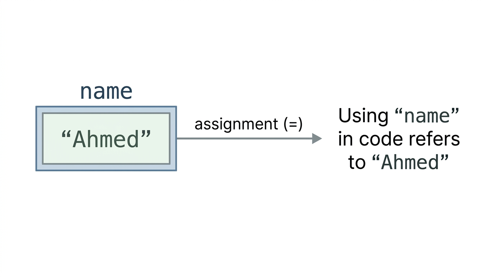
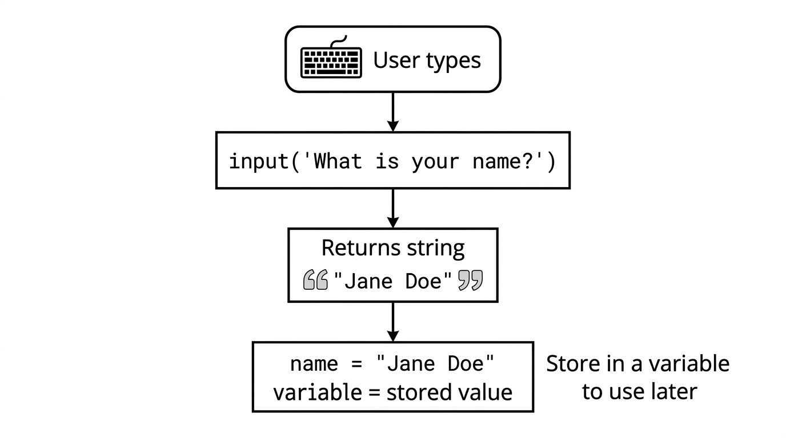
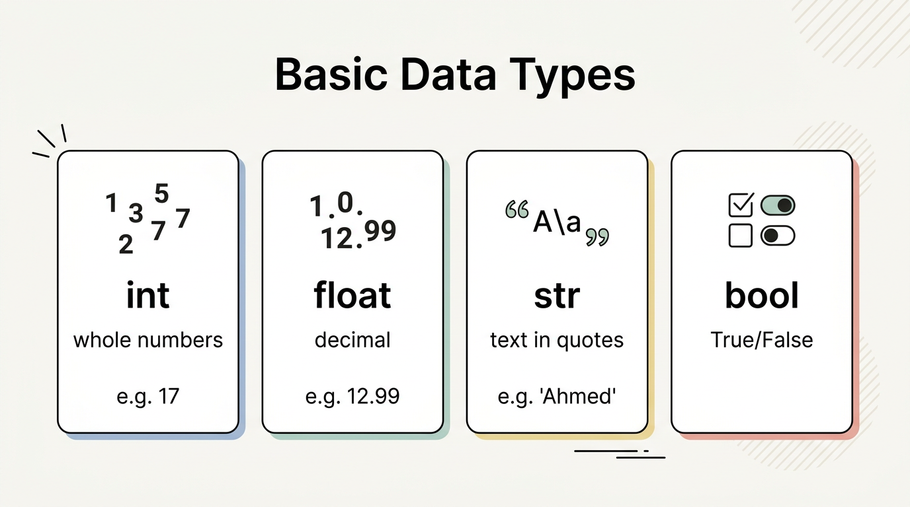
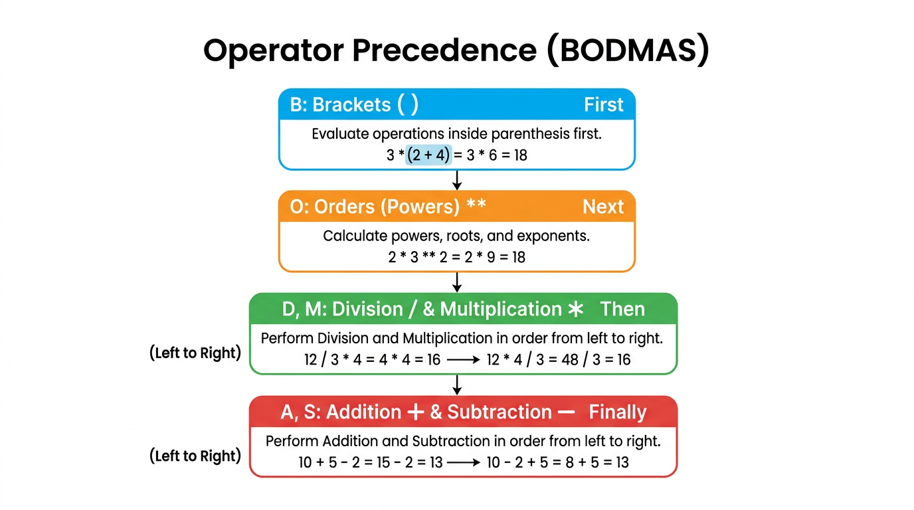
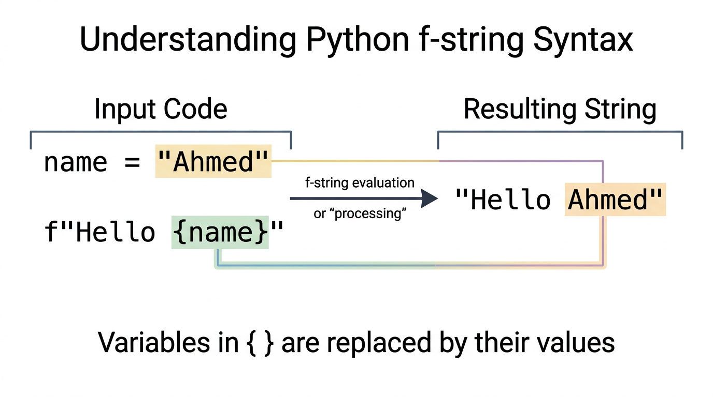

# Chapter: Variables in Python

---

## 1. Introduction: The Role of Variables in Programming

When we write a program, we often need to **store** a value so we can use it again: a student’s name, the number of ajza memorized, the name of a city or a madrasa, or the price of a book in the Maktaba. In Python, we store values in **variables**. A variable is a named place in the computer’s memory that holds a value. Once we assign a value to a variable, we can use that name in our code instead of typing the value again.

Variables are used for:

- **Storing text** — names (e.g. Hafiz Usman), cities (Lahore, Multan), madrasa names, book titles, Surah names
- **Storing numbers** — age, marks, number of students in a class, price in rupees, number of ajza
- **Storing what the user types** — when we use `input()`, we usually store the result in a variable so we can use it later
- **Building messages** — we combine variables with fixed text to print sentences (e.g. "You study at " + madrasa)

This chapter explains what a variable is, how to create and name one, how to get user input into a variable, the main **data types** (integer, float, string, boolean), **type conversion**, **variable naming** rules, basic **math operators**, **operator precedence** (BODMAS), and **f-strings** for clear, dynamic messages. The examples are chosen to be relevant to students in a madrasa or Jamia: names, subjects, books, Islamic months, and everyday situations in Pakistan.

---

## 2. Concept 1: What Is a Variable and How Do We Assign a Value?

### 2.1 Concept

A **variable** is a name that refers to a value stored in the computer’s memory. We **assign** a value to a variable using the equals sign `=`. The statement `name = "Ahmed"` means: “Store the string `"Ahmed"` in a variable called `name`.” From that point on, whenever we use `name` in our code, Python uses the value `"Ahmed"`.



We choose the variable name (e.g. `name`, `city`, `age`). The value can be text (a string), a number (integer or float), or something else. Once a variable holds a value, we can use it in `print()`, in calculations, or in building longer messages with `+`.

### 2.2 Code: Basic String Variables

```python
greeting = "Assalamu Alaikum"
print(greeting)
```

- **Line 1:** We **assign** the string `"Assalamu Alaikum"` to the variable `greeting`. The variable name is on the left of `=`, the value on the right.
- **Line 2:** We print the value of `greeting`. The output is: Assalamu Alaikum.

```python
name = "Ahmed"
print("My name is " + name)
```

- **Line 1:** The variable `name` holds the string `"Ahmed"`.
- **Line 2:** We concatenate the string `"My name is "` with the value of `name`. The output is: My name is Ahmed.

```python
first_name = "Hafiz"
last_name = "Ali"
print(first_name + " " + last_name)
```

- **Lines 1–2:** Two variables store the first and last name.
- **Line 3:** We join them with a space in between. The result is: Hafiz Ali.

```python
city = "Lahore"
print("I live in " + city)
```

- **Line 1:** The variable `city` holds the name of the city.
- **Line 2:** We build a sentence using the variable. Output: I live in Lahore.

### 2.3 Using input() to Set a Variable

We can also set a variable using the user’s input. The function `input("prompt")` shows a message to the user, waits for them to type something, and returns what they typed as a string. We store that string in a variable.

```python
subject = input("Enter your favorite subject: ")
print("You like " + subject)
```

- **Line 1:** The user sees "Enter your favorite subject: " and types (e.g. Quran). Whatever they type is stored in `subject`.
- **Line 2:** We print a message using that value. Output (for example): You like Quran.

---

## 3. Concept 2: Getting User Input and Storing in Variables

### 3.1 Concept

Programs often need to ask the user for information: their name, their madrasa, their favourite book or Surah, or their city. The built-in function `input("prompt")` displays the prompt, waits for the user to type, and returns the typed text as a **string**. We almost always store that string in a variable so we can use it in our program (e.g. in `print`, or with `len()`). Without a variable, we would have no way to refer to what the user typed.



### 3.2 Code: Name, Book, Madrasa, Surah

```python
name = input("What is your name? ")
print("Welcome " + name)
```

- **Line 1:** The user is asked for their name. Their answer is stored in `name`.
- **Line 2:** We print "Welcome " followed by the value of `name`.

```python
book = input("Enter your favorite Islamic book: ")
print("You like the book " + book)
```

- **Line 1:** The user enters a book name (e.g. from the Maktaba). It is stored in `book`.
- **Line 2:** We print a sentence using that value.

```python
madrasa = input("What is the name of your madrasa? ")
print("You study at " + madrasa)
```

- **Line 1:** The user enters the madrasa or Jamia name. It is stored in `madrasa`.
- **Line 2:** We print "You study at " followed by that name.

```python
surah = input("Which Surah do you love the most? ")
print("Surah " + surah + " is very beautiful.")
```

- **Line 1:** The user enters a Surah name. It is stored in `surah`.
- **Line 2:** We build a sentence with the variable in the middle. We use two `+` operators to join three parts.

```python
first = input("Enter first name: ")
second = input("Enter second name: ")
print("Friends: " + first + " and " + second)
```

- **Lines 1–2:** We ask for two names and store them in `first` and `second`.
- **Line 3:** We print one sentence that includes both variables.

### 3.3 Using len() with a Variable

The built-in function `len()` returns the number of characters in a string. We can pass a variable that holds a string. When we want to print that number together with a message, we must convert the number to a string using `str()`, because we cannot use `+` to join a string and a number directly.

```python
name = input("Enter your name: ")
print("The number of characters in your name is: " + str(len(name)))
```

- **Line 1:** The user’s name is stored in `name`.
- **Line 2:** `len(name)` gives an integer. `str(len(name))` converts it to a string so we can concatenate it with the message. We then print the full sentence.

```python
surah = input("Enter your favorite Surah: ")
print("Length of Surah name is: " + str(len(surah)))
```

- **Line 1:** The user enters a Surah name; it is stored in `surah`.
- **Line 2:** We print the length of that string. Again we use `str()` so we can use `+` with the rest of the message.

**Alternative:** We can use a comma in `print()` instead of `+`. A comma automatically adds a space and allows mixing strings and numbers:

```python
name = input("Enter your name again: ")
name_length = len(name)
print("Number of letters in your name is:", name_length)
```

- **Line 1:** We store the user’s input in `name`.
- **Line 2:** We store the length in another variable, `name_length`.
- **Line 3:** `print(..., name_length)` prints the message and the number. No `str()` is needed when using a comma.

---

## 4. Concept 3: Data Types (int, float, str, bool) and type()

### 4.1 Concept

In Python, every value has a **data type**. The type tells Python what kind of data it is and what we can do with it. For example, we can add two numbers, but we cannot add a number and a string with `+` unless we convert one of them. The main types we use at this level are:

- **int (integer)** — whole numbers without a decimal point (e.g. age, number of students, number of ajza).
- **float** — numbers with a decimal point (e.g. price in rupees, temperature, average marks).
- **str (string)** — text enclosed in quotes (e.g. name, city, madrasa name, Surah name).
- **bool (boolean)** — only `True` or `False` (e.g. “Is he a student?”).

We can check the type of any value or variable with the built-in function `type()`. It returns the type (e.g. `<class 'int'>`, `<class 'str'>`). Understanding types helps us avoid errors: for example, if we want to print "Your age is: " and then a number, we must either use `str(age)` with `+` or use `print("Your age is:", age)` with a comma.

**Important:** `input()` always returns a **string**. If the user types a number, we get the digits as text (e.g. `"17"`), not the number 17. To do maths with it, we must convert it using `int()` or `float()` (see Concept 4).



### 4.2 Code: Integer, Float, String, Boolean

```python
age = 17
print("Age:", age)
print("Data type of age is:", type(age))
```

- **Line 1:** We assign the integer `17` to `age`. There are no quotes, so Python treats it as a number.
- **Lines 2–3:** We print the value and its type. The type of `age` is `int`.

```python
price = 12.99
print("Price:", price)
print("Data type of price is:", type(price))
```

- **Line 1:** We assign a decimal number to `price`. Python treats it as a **float**.
- **Lines 2–3:** We print the value and its type. The type is `float`.

```python
name = "Ahmed"
print("Name:", name)
print("Data type of name is:", type(name))
```

- **Line 1:** The value is in quotes, so it is a **string**.
- **Lines 2–3:** We print the value and its type. The type is `str`.

```python
is_student = True
print("Is student:", is_student)
print("Data type of is_student is:", type(is_student))
```

- **Line 1:** `True` is a **boolean** value (note the capital T). The other boolean is `False`.
- **Lines 2–3:** We print the value and its type. The type is `bool`.

### 4.3 Mixing int and str: Why We Need str()

We cannot use `+` to join a string and a number directly. For example, `"Your age is: " + 17` causes an error. To build a message that includes a number, we must either convert the number to a string with `str()`, or use `print()` with a comma.

```python
age = 17
print("Your age is: " + str(age))
```

- **Line 2:** `str(age)` converts the integer 17 to the string `"17"`. Then we can concatenate with `+`. Output: Your age is: 17.

```python
print("Your age is:", age)
```

- Using a comma in `print()` also works: Python prints each part with a space between them, and numbers are shown without needing `str()`.

---

## 5. Concept 4: Type Conversion (int(), float(), str())

### 5.1 Concept

Sometimes we have a value of one type and we need it as another type. For example, the user types `"25"` (a string), but we want to add 5 to it — we need an integer. Or we have the number 17 and we want to put it inside a sentence — we need a string. **Type conversion** is the process of turning one type into another using built-in functions:

- **int(...)** — converts a value to an integer. If we pass a float, the decimal part is dropped. The string must represent a whole number (e.g. `"25"`), not letters or a decimal string like `"25.5"` (use `float()` first, then `int()` if needed).
- **float(...)** — converts to a decimal number. We can pass an integer or a string like `"12.75"`.
- **str(...)** — converts any value to a string. We use this when we want to concatenate a number with text using `+`.

If we try to convert invalid data (e.g. `int("abc")` or `int("12.5")`), Python raises an error. So we must convert only when the value is suitable (e.g. user typed a number).

### 5.2 Code: String to int and float; int to str

```python
num_str = "25"
num_int = int(num_str)
print("1. String to Int:", num_int + 5)
```

- **Line 1:** `num_str` is a string containing digits.
- **Line 2:** `int(num_str)` converts it to the integer 25 and stores it in `num_int`.
- **Line 3:** We can now do maths: `num_int + 5` is 30.

```python
price_str = "12.75"
price_float = float(price_str)
print("2. String to Float:", price_float + 2.25)
```

- **Line 1:** The string looks like a decimal number.
- **Line 2:** `float(price_str)` converts it to 12.75.
- **Line 3:** We add 2.25 and print the result.

```python
students = 30
students_str = str(students)
print("3. Int to String:", "Total students: " + students_str)
```

- **Line 1:** `students` is an integer.
- **Line 2:** `str(students)` converts it to the string `"30"`.
- **Line 3:** We can now concatenate with `+`. Output: Total students: 30.

```python
user_input = input("Enter a number: ")
num = int(user_input)
print("You entered:", num, "and its square is:", num * num)
```

- **Line 1:** The user types something; it is stored as a string (e.g. `"7"`).
- **Line 2:** We convert it to an integer so we can do maths. If the user does not type a valid integer, this line will raise an error.
- **Line 3:** We print the number and its square.

### 5.3 Common Conversion Errors (Concept and Fix)

- **Converting non-numeric text to int:** `int("abc")` causes a **ValueError**. Only use `int()` on strings that represent a whole number (e.g. `"123"`).
- **Mixing int and str with +:** `"You are " + 20 + " years old."` causes a **TypeError**. Fix: use `str(20)` or `print("You are ", 20, " years old.")`.
- **Converting empty string to int:** `int("")` causes **ValueError**. Check that the string is not empty before converting.
- **Converting a float string directly to int:** `int("45.6")` causes **ValueError**. First use `float("45.6")`, then `int(...)` if you want the whole number part.
- **Using input() for a number but not converting:** `num = input("Enter number: ")` then `print(num + 5)` causes **TypeError** because `num` is a string. Fix: `num = int(input("Enter number: "))`.

---

## 6. Concept 5: Variable Naming Rules and Tips

### 6.1 Concept

Variable names are chosen by the programmer. Python has rules that must be followed; otherwise the code will not run. There are also **conventions** (recommended style) that make code easier to read, especially when working in a team or in a madrasa class.

**Rules (must follow):**

- A variable name can contain letters (a–z, A–Z), digits (0–9), and underscores (_).
- It **cannot start with a digit**. So `student1` is allowed, but `1student` is not.
- It **cannot contain spaces**. Use an underscore instead: `student_name`, not `student name`.
- It **cannot use hyphens** or symbols like `$`, `%`, `!`. So use `student_name`, not `student-name`.
- It **cannot be a Python keyword** (e.g. `class`, `if`, `for`). So use `student_class`, not `class`.

**Conventions (recommended):**

- Use **snake_case**: lowercase letters and underscores (e.g. `student_name`, `total_marks`). This is the standard in Python (PEP 8).
- Use a name that describes the value (e.g. `city`, `madrasa`, `number_of_ajza`), not a single letter like `x` unless the meaning is very clear.
- Be consistent: if you use `student_name` in one place, do not use `StudentName` in another — Python treats them as different variables because names are **case-sensitive** (`RollNumber` and `rollnumber` are two different variables).

**Using a variable before defining it:** We must assign a value to a variable before we use it. If we write `print(age)` before `age = 14`, we get an error.

### 6.2 Code: Correct and Incorrect Names

```python
# Correct:
full_name = "Ahmed"
student1 = "Ali"
student_name = "Ayesha"
student_class = "Grade 5"
total_marks = 500
subject_name = "Quran"
```

- **Line 2:** No spaces; we use `full_name`.
- **Line 3:** A digit is allowed, but not at the start; `student1` is valid.
- **Line 4:** We use an underscore instead of a hyphen.
- **Line 5:** We avoid the keyword `class` by using `student_class`.
- **Line 6:** We avoid symbols; we use `total_marks` not `total$marks`.
- **Line 7:** A clear name is better than `x` when we store something like a subject name.

```python
# Must define before use:
age = 14
print(age)
```

- We assign `age` first, then we can safely use it in `print()`.

---

## 7. Concept 6: Basic Math Operators (+, -, *, /, //, %, **)

### 7.1 Concept

Python provides operators for doing maths with numbers (integers and floats):

- **+** Addition — add two numbers.
- **-** Subtraction — subtract the second from the first.
- ***** Multiplication — multiply two numbers.
- **/** Division — divide; the result is always a float (e.g. 12 / 4 is 3.0).
- **//** Floor division — divide and take only the whole number part (no decimal).
- **%** Modulus — the **remainder** after division (e.g. 13 % 4 is 1).
- ****** Exponent — raise to a power (e.g. 2 ** 3 is 8, meaning 2×2×2).

These operators work with variables too: if `a = 10` and `b = 3`, then `a + b` is 13, `a // b` is 3, and `a % b` is 1. We use these in everyday situations: total students, total cost (price × quantity), sharing money equally (division), or counting leftovers (modulus).

### 7.2 Code: Operators with Madrasa and Local Examples

```python
print("Addition: Total age of two Hafiz students:", 12 + 15)
print("Total Islamic books in two subjects:", 40 + 30)
print("Total bills of two months (rupees):", 1200 + 1350)
```

- **Lines 1–3:** Addition. We use numbers that could represent ages, books, or monthly bills.

```python
print("Subtraction: Remaining copies:", 50 - 18)
print("Present students:", 25 - 3)
print("Final price after discount (rupees):", 1000 - 150)
```

- **Lines 1–3:** Subtraction (e.g. total minus used, total minus absent, price minus discount).

```python
print("Multiplication: Total ajza memorized (30 ajza × 5 students):", 30 * 5)
print("Total pages (200 per book × 4 books):", 200 * 4)
print("Total cost of sugar (170 per kg × 5 kg, rupees):", 170 * 5)
```

- **Lines 1–3:** Multiplication (e.g. ajza per student × students, pages × books, price per kg × kg).

```python
print("Division: Each person receives (zakat, rupees):", 10000 / 5)
print("Books per student:", 12 / 3)
print("Each friend pays (rupees):", 1200 / 3)
```

- **Lines 1–3:** Division gives a float. Example: sharing zakat, books per student, splitting a bill.

```python
print("Floor Division: Qurans per row (25 Qurans, 3 rows):", 25 // 3)
print("Chairs per row:", 40 // 6)
print("Rupees per child (1000 rupees, 7 children):", 1000 // 7)
```

- **Lines 1–3:** Floor division drops the decimal. We get whole numbers only.

```python
print("Modulus (remainder): Leftover Qurans:", 25 % 3)
print("Leftover sweets:", 40 % 6)
print("Remainder amount (rupees):", 1000 % 7)
```

- **Lines 1–3:** Modulus gives the remainder. Useful when we cannot divide equally.

```python
print("Exponent: 2 ** 3 =", 2 ** 3)
print("3 squared =", 3 ** 2)
```

- **Lines 1–2:** Exponent: 2 ** 3 is 8, 3 ** 2 is 9.

---

## 8. Concept 7: Operator Precedence (BODMAS)

### 8.1 Concept

When an expression has more than one operator (e.g. `5 + 3 * 2`), Python does not always work from left to right. It follows **precedence** rules, similar to **BODMAS** in mathematics:

- **B** — Brackets (parentheses) first: `(5 + 3) * 2` means add first, then multiply.
- **O** — Orders (powers): `**` is done before `*` and `/`.
- **D** and **M** — Division and Multiplication (same level; left to right).
- **A** and **S** — Addition and Subtraction (same level; left to right).

So in `5 + 3 * 2`, multiplication is done first: 3 * 2 = 6, then 5 + 6 = 11. If we want the addition first, we use brackets: `(5 + 3) * 2` = 16. Writing brackets makes the order clear and avoids mistakes.



### 8.2 Code: With and Without Brackets

```python
print("Without brackets: 5 + 3 * 2 =", 5 + 3 * 2)
print("With brackets: (5 + 3) * 2 =", (5 + 3) * 2)
```

- **Line 1:** Multiplication first: 3 * 2 = 6, then 5 + 6 = 11.
- **Line 2:** Brackets first: 5 + 3 = 8, then 8 * 2 = 16.

```python
print("Power before multiply: 2 * 3 ** 2 =", 2 * 3 ** 2)
print("With brackets: (2 + 1) ** 3 =", (2 + 1) ** 3)
```

- **Line 1:** Power first: 3 ** 2 = 9, then 2 * 9 = 18.
- **Line 2:** Brackets first: 2 + 1 = 3, then 3 ** 3 = 27.

```python
print("Islamic example: 33 tasbeeh in 3 prayers, twice =", (33 * 3) + (33 * 3))
print("30 ajza × 20 pages minus 10 missed =", (30 * 20) - 10)
print("12 students, 5 ayat each =", 12 * 5)
```

- **Lines 1–3:** Brackets make the intended order clear: first compute each part, then add or subtract.

```python
print("Local example: One book 250 rupees, 4 books =", 250 * 4)
print("Bill 1800 minus discount 300 =", 1800 - 300)
print("1500 rupees among 5 friends =", 1500 / 5)
```

- **Lines 1–3:** Simple expressions that could represent buying books, a bill, or sharing money.

---

## 9. Concept 8: f-strings for Dynamic Messages

### 9.1 Concept

When we build a message that mixes fixed text with variables (and sometimes numbers or expressions), we can use **concatenation** with `+` and `str()`. But that becomes long and hard to read. **f-strings** (formatted string literals) make it easier: we put the letter `f` before the opening quote of a string and write variables or expressions inside curly braces `{ }`. Python evaluates what is inside the braces and inserts the result into the string. We do not need to call `str()` for numbers when we use an f-string.

Syntax: `f"text {variable} more text"`. We can also write expressions: `f"{name} will be {age + 1} years old next year."`



### 9.2 Code: With and Without f-strings

```python
name = "Ahmed"
print("My name is " + name)
print(f"My name is {name}")
```

- **Line 2:** Using concatenation.
- **Line 3:** Using an f-string. The result is the same. The `f` before the quote and `{name}` inside the string produce "My name is Ahmed".

```python
name = "Ahmed"
age = 15
print(name + " is " + str(age) + " years old.")
print(f"{name} is {age} years old.")
```

- **Line 3:** We must use `str(age)` when we concatenate with `+`.
- **Line 4:** In the f-string, we write `{age}`; Python converts it to text automatically. No `str()` needed.

```python
student = "Hafiz Usman"
ajza = 18
print(student + " has memorized " + str(ajza) + " ajza of the Quran.")
print(f"{student} has memorized {ajza} ajza of the Quran.")
```

- **Lines 3–4:** Same idea: f-string is shorter and clearer. Good for madrasa examples (student name and ajza).

```python
marks = 85
print(name + " scored " + str(marks) + " marks in the test.")
print(f"{name} scored {marks} marks in the test.")
```

```python
item = "Flour"
price = 135
kg = 5
print(f"{kg} kg of {item} costs {price * kg} rupees.")
```

- **Line 5:** We can put an expression inside the braces: `price * kg` is calculated and then shown in the message.

```python
tasbeeh = 33
prayers = 5
total_tasbeeh = tasbeeh * prayers
print(f"You recited {tasbeeh} tasbeeh in each prayer, total: {total_tasbeeh}.")
```

- **Lines 1–3:** We store values and compute `total_tasbeeh`.
- **Line 4:** The f-string includes both the number per prayer and the total.

```python
student_name = "Fatima"
current_age = 13
print(f"{student_name} will be {current_age + 1} years old next year.")
```

- **Line 3:** The expression `current_age + 1` is evaluated and the result is inserted into the string.

```python
your_name = input("Enter your name: ")
your_class = input("Which class are you in? ")
print(f"You are {your_name} and you are in class {your_class}.")
```

- **Lines 1–2:** We store the user’s input in two variables.
- **Line 3:** We build one sentence with an f-string. Clear and easy to read.

---

## 10. Exercises

All exercises use variables, `input()` where asked, and the concepts from this chapter. Use clear variable names (snake_case) and PEP 8 style.

### Set A: Variables and input

1. Ask the user for the name of their city. Store it in a variable and print how many characters are in the city name (use `len()`).
2. Ask the user for the name of an Islamic scholar they admire. Store it in a variable and print the number of letters in that name.
3. Ask the user for a short Islamic quote or sentence. Store it in a variable and print the number of characters in that sentence.

**Model solutions**

```python
# 1
city = input("Enter the name of your city: ")
print("Number of characters in the city name is:", len(city))

# 2
scholar = input("Enter the name of an Islamic scholar you admire: ")
print("Number of letters in the scholar's name is:", len(scholar))

# 3
quote = input("Write a short Islamic quote or sentence: ")
print("Number of characters in your sentence is:", len(quote))
```

### Set B: Variable logic (combining and reusing)

1. **Full name:** You have `first_name = "Hafiz"` and `last_name = "Usman"`. Create a variable `full_name` that combines them with a space and print it.
2. **Reverse order:** You have `word1 = "peace"` and `word2 = "love"`. Create a variable that combines them in reverse order (love peace) and print it.
3. **Repeat:** You have `item = "Quran"`. Create a variable that repeats this word three times with spaces (Quran Quran Quran) and print it.

**Model solutions**

```python
# 1
first_name = "Hafiz"
last_name = "Usman"
full_name = first_name + " " + last_name
print("Full Name:", full_name)

# 2
word1 = "peace"
word2 = "love"
secret = word2 + " " + word1
print("Combined:", secret)

# 3
item = "Quran"
repeat_item = item + " " + item + " " + item
print("Repeated:", repeat_item)
```

### Set C: Types, conversion, and maths

1. Create a variable `age` with value 14 and a variable `name` with value `"Ahmed"`. Using an f-string, print one sentence that includes both (e.g. "Ahmed is 14 years old.").
2. Ask the user to enter a number. Convert it to an integer, store it in a variable, and print its double (2 times the number).
3. Store the number of students (e.g. 30) and the number of books (e.g. 120). Using variables and division, print how many books per student (as a float).
4. Store a price (e.g. 250) and quantity (e.g. 4). Using multiplication, compute and print the total cost in rupees with an f-string.

**Model solutions**

```python
# 1
age = 14
name = "Ahmed"
print(f"{name} is {age} years old.")

# 2
user_num = int(input("Enter a number: "))
print("Double of your number is:", user_num * 2)

# 3
students = 30
books = 120
books_per_student = books / students
print("Books per student:", books_per_student)

# 4
price = 250
quantity = 4
total = price * quantity
print(f"Total cost: {total} rupees.")
```

---

## 11. Summary and Key Terms

- **Variable** — A name that refers to a value stored in memory. We assign a value with `=`.
- **Assignment** — Giving a value to a variable (e.g. `name = "Ahmed"`). The value on the right is stored under the name on the left.
- **input(prompt)** — Built-in function that shows the prompt, reads what the user types, and returns it as a **string**. We usually store the result in a variable.
- **Data type** — The kind of value: **int** (integer), **float** (decimal), **str** (string), **bool** (True/False). We can check with `type()`.
- **Type conversion** — Turning one type into another: **int()**, **float()**, **str()**. Needed when we mix numbers and strings (e.g. `str(age)` for concatenation) or when we need to do maths on user input (e.g. `int(input(...))`).
- **Variable naming** — Rules: no spaces, cannot start with a digit, no hyphens or special symbols, cannot use keywords. Convention: **snake_case** (e.g. `student_name`). Names are case-sensitive.
- **Math operators** — `+`, `-`, `*`, `/`, `//` (floor division), `%` (remainder), `**` (exponent).
- **Operator precedence (BODMAS)** — Brackets first, then powers, then multiplication and division, then addition and subtraction. Use brackets to make order clear.
- **f-string** — A string prefixed with `f` in which `{variable}` or `{expression}` is evaluated and inserted (e.g. `f"{name} is {age} years old."`). Easier than concatenation with `str()` when building messages.
- **len(string)** — Returns the number of characters in a string. We often use it with a variable that holds a string.

All code in this chapter follows **PEP 8** style. The examples are chosen to be relevant to students in a madrasa or Jamia: names, cities (e.g. Lahore, Multan), books, Surahs, ajza, tasbeeh, students, and everyday situations in Pakistan.
