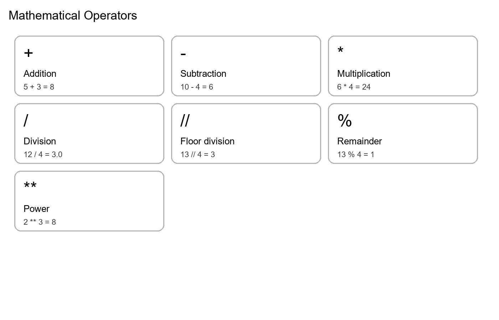
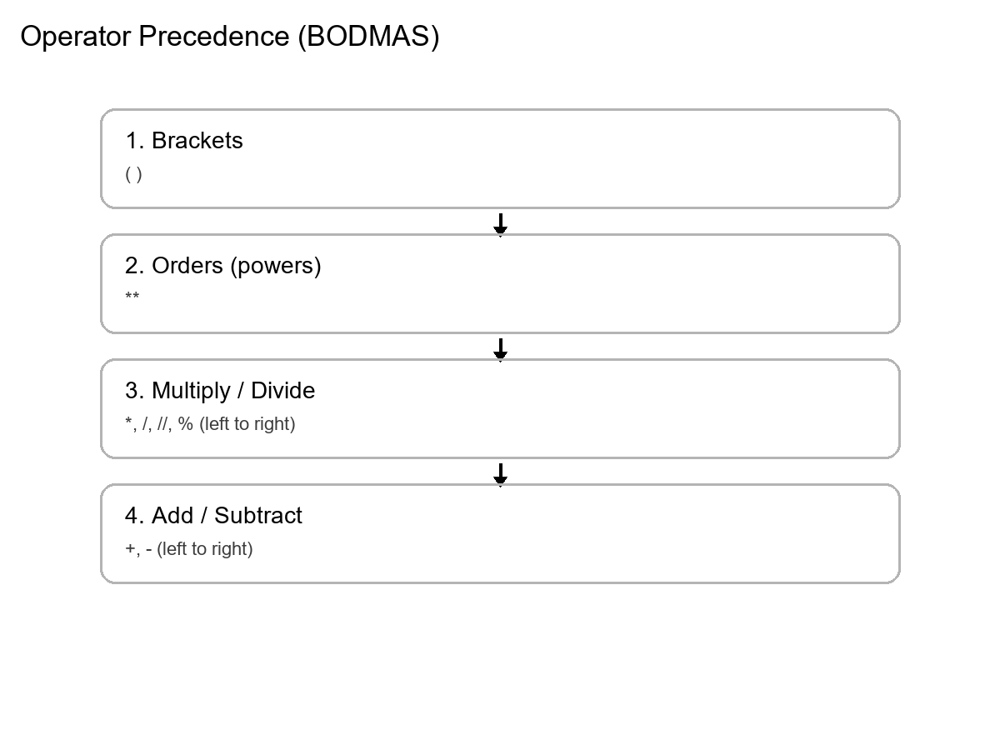
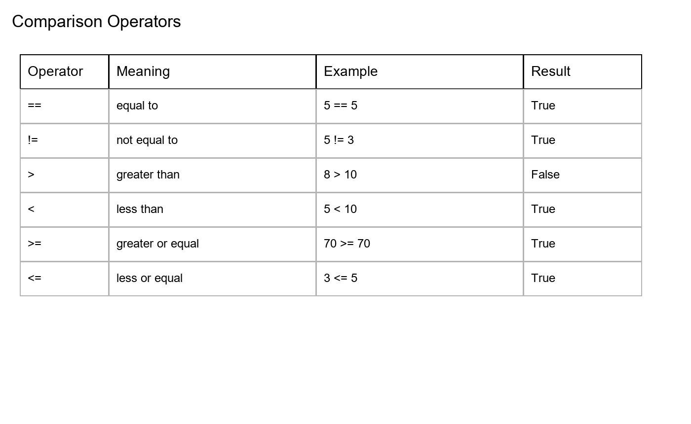
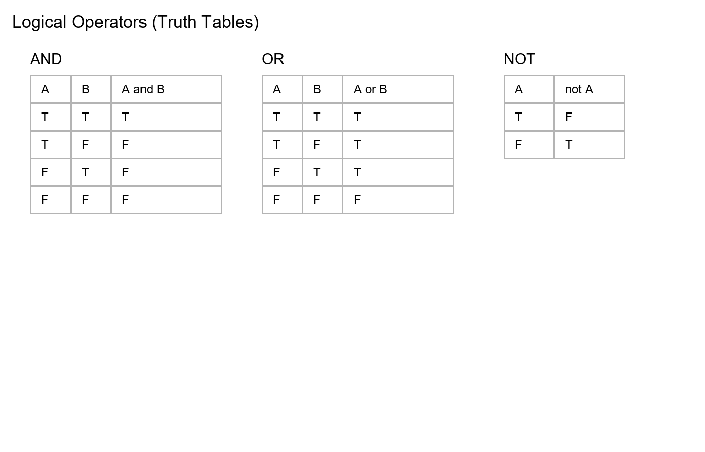

# Chapter: Operators in Python (Mathematical, Comparison, Logical)

---

## 1. Mathematical Operators

### 1.1 Concept (What operators do)

In Python, an **operator** is a symbol (or special keyword) that performs an operation on values. In this section we focus on **mathematical operators**, which work with numbers such as:

- **int** (whole numbers): 5, 12, 250
- **float** (decimal numbers): 12.5, 99.99

Mathematical operators are used in everyday madrasa and Pakistani life calculations:

- total books in a Maktaba (addition)
- present students (subtraction)
- price × quantity (multiplication)
- sharing rupees equally (division)
- equal distribution with leftovers (floor division and remainder)

### 1.2 List of mathematical operators

- **Addition (`+`)**: add values
- **Subtraction (`-`)**: subtract values
- **Multiplication (`*`)**: multiply values
- **Division (`/`)**: divide values (result is float)
- **Floor Division (`//`)**: divide and keep only whole number part
- **Modulus (`%`)**: remainder after division
- **Exponent (`**`)**: power, e.g. \(2^3\)



### 1.3 Very simple examples (start small)

```python
print(5 + 3)
print(10 - 4)
print(6 * 4)
print(12 / 4)
```

- **Line 1:** `5 + 3` → 8
- **Line 2:** `10 - 4` → 6
- **Line 3:** `6 * 4` → 24
- **Line 4:** `12 / 4` → 3.0 (division returns float)

### 1.4 Floor division and remainder (distribution problems)

When we distribute items equally, we often need **two different kinds of answers**:

1. **The equal share (whole number)**: “How many does each person/shelf/row get if we distribute equally?”
2. **The leftover (remainder)**: “After giving equal shares, how many items are still left?”

Python gives us two operators for these two answers:

- **Floor Division (`//`)** gives the **whole-number quotient** (the equal share).  
  It **throws away** any decimal part.
- **Modulus (`%`)** gives the **remainder** (the leftover items).

This is extremely common in real life:

- Distributing Qurans on shelves in a Maktaba
- Distributing notebooks among students
- Sharing dates among friends after class
- Arranging chairs in equal rows

#### Important difference: `/` vs `//`

- `/` gives a **float** result (it keeps decimals). Example: `25 / 3` is `8.333...`
- `//` gives a **whole number** result. Example: `25 // 3` is `8`

So, if you are distributing **physical items**, you usually want `//` and `%`, not `/`.

#### How to think about it (simple idea)

If `total = groups * share + leftover`, then:

- `share = total // groups`
- `leftover = total % groups`

Both results come from the same division, but they answer two different questions.

1. **How many each person gets** (whole number) → use `//`
2. **How many are left over** → use `%`

Example: 25 Qurans distributed in 3 shelves.

```python
qurans = 25
shelves = 3

per_shelf = qurans // shelves
leftover = qurans % shelves

print("Qurans per shelf:", per_shelf)
print("Leftover Qurans:", leftover)
```

- **Line 1–2:** We store total items and number of groups.
- **Line 4:** `//` gives the whole-number share.
- **Line 5:** `%` gives the remainder.
- **Lines 7–8:** We print results.

### 1.5 Exponent (power) with simple meaning

The operator **Exponent (`**`)** is used for **powers**. It answers questions like:

- “What is \(2^3\) ?”
- “What is \(3^2\) (three squared)?”

In Python:

- `a ** b` means: “raise `a` to the power `b`.”

#### What it means in multiplication form

When `b` is a positive whole number:

- `a ** 1` means `a`
- `a ** 2` means `a * a`
- `a ** 3` means `a * a * a`

So, we can say:

`a ** b` means multiply `a` by itself `b` times.

#### Why it is useful

Exponent is used in many places:

- Square of a number (area-type calculations): `n ** 2`
- Cube of a number (volume-type calculations): `n ** 3`
- Fast growth examples in maths practice

At this level, the most important thing is to remember: `**` is **not** multiplication.  
For multiplication we use `*`. For power we use `**`.

```python
print(2 ** 3)
print(3 ** 2)
```

- **Line 1:** \(2^3 = 2 \times 2 \times 2 = 8\)
- **Line 2:** \(3^2 = 3 \times 3 = 9\)

### 1.6 Program 1 (simple → practical): Madrasa shop bill

**Concept:** Total cost is always **price × quantity**.

```python
item_price = 250
quantity = 4

total_cost = item_price * quantity
print("Total cost (rupees):", total_cost)
```

- **Line 1:** Price per item (rupees).
- **Line 2:** Quantity purchased.
- **Line 4:** Multiplication gives total cost.
- **Line 5:** Print the result.

### 1.7 Program 2 (slightly more complex): Total pages to revise

**Scenario:** A student revises 20 pages daily for 7 days. How many pages total?

```python
pages_per_day = 20
days = 7

total_pages = pages_per_day * days
print("Total pages revised:", total_pages)
```

- **Line 1–2:** Store daily pages and days.
- **Line 4:** Multiply to get total pages.
- **Line 5:** Print.

### 1.8 Program 3 (mixing operators): Monthly budget leftover

**Scenario:** You have 5000 rupees. You buy 2 books at 850 each and also pay 600 rupees for stationery. How much is left?

```python
budget = 5000
book_price = 850
books = 2
stationery = 600

spent = (book_price * books) + stationery
left = budget - spent

print("Total spent:", spent)
print("Money left:", left)
```

- **Line 1–4:** Store values.
- **Line 6:** Multiply for book cost, then add stationery (brackets make it clearer).
- **Line 7:** Subtract spent from budget.
- **Lines 9–10:** Print both.

---

## 2. Operator Precedence (BODMAS)

### 2.1 Concept (how Python decides the order)

When we write an expression like `10 + 5 * 3`, Python must decide what to do first. Python follows operator precedence rules similar to **BODMAS**:

1. **Brackets**: `( )`
2. **Orders (powers)**: `**`
3. **Multiply / Divide**: `*`, `/`, `//`, `%` (left to right)
4. **Add / Subtract**: `+`, `-` (left to right)

This is why `10 + 5 * 3` becomes 25 (not 45): multiplication happens first.



### 2.2 Simple to complex examples

```python
print("10 + 5 * 3 =", 10 + 5 * 3)
print("(10 + 5) * 3 =", (10 + 5) * 3)
```

- **Line 1:** `5 * 3` happens first → 15, then `10 + 15` → 25.
- **Line 2:** Brackets first → 15, then `15 * 3` → 45.

```python
print("2 * 3 ** 2 =", 2 * 3 ** 2)
print("(2 * 3) ** 2 =", (2 * 3) ** 2)
```

- **Line 1:** Power first: `3 ** 2` → 9, then `2 * 9` → 18.
- **Line 2:** Brackets first: `(2*3)` → 6, then `6 ** 2` → 36.

### 2.3 Program 4: Total tasbeeh in a week (clear brackets)

**Scenario:** After each prayer, a student reads 33 tasbeeh. There are 5 prayers per day. For 7 days, how many total?

```python
tasbeeh_per_prayer = 33
prayers_per_day = 5
days = 7

total = tasbeeh_per_prayer * prayers_per_day * days
print("Total tasbeeh in a week:", total)
```

- **Line 1–3:** Store values.
- **Line 5:** Multiplication is left-to-right; we can multiply all three.
- **Line 6:** Print the result.

---

## 3. Comparison Operators

### 3.1 Concept (True/False comparisons)

Comparison operators compare two values and produce a boolean result: `True` or `False`.

- **Equal to (`==`)**
- **Not equal to (`!=`)**
- **Greater than (`>`)**
- **Less than (`<`)**
- **Greater than or equal to (`>=`)**
- **Less than or equal to (`<=`)**



### 3.2 Simple comparisons (numbers and strings)

```python
print(15 >= 10)
print(8 < 10)
print("Fajr" == "Fajr")
print("Maghrib" != "Isha")
```

- **Line 1:** True
- **Line 2:** True
- **Line 3:** True (same text)
- **Line 4:** True (different text)

### 3.3 Program 5: Pass/fail check using comparisons (no if yet)

**Concept:** A “pass” condition is a boolean expression like `marks >= 70`.

```python
marks = 68
passed = marks >= 70
print("Passed:", passed)
```

- **Line 1:** Store marks.
- **Line 2:** Comparison returns True/False and is stored in `passed`.
- **Line 3:** Print the boolean result.

### 3.4 Program 6: Range check (between two values)

**Scenario:** Check if age is between 10 and 15 (inclusive). We use two comparisons and later we will join them using `and` (next section), but even now we can see each part.

```python
age = 12
print(age >= 10)
print(age <= 15)
```

- **Line 2:** Is age at least 10?
- **Line 3:** Is age at most 15?

---

## 4. Boolean Values: True and False (Before and/or/not)

### 4.1 Concept (what True/False means in Python)

In Python, **True** and **False** are special values of the **bool** (boolean) type.

- **True** means a condition is correct / satisfied.
- **False** means a condition is not correct / not satisfied.

Logical operators `and`, `or`, and `not` do not work on “sentences” directly. They work on **boolean values** (True/False). So before we use `and` and `or`, we must know where True/False come from.

There are two common ways students will meet booleans at this level:

1. **Direct booleans** (we assign True/False ourselves)  
   Example: `has_attended_class = True`
2. **Comparisons produce booleans**  
   Example: `marks >= 70` produces True or False automatically.

**Important detail:** In Python, the words are written with capital letters: `True` and `False`. Writing `true` or `false` is an error.

### 4.2 Code: Direct booleans (manual)

```python
has_attended_class = True
has_done_homework = False
print("Attended:", has_attended_class)
print("Homework done:", has_done_homework)
```

- **Line 1:** A boolean variable set to True.
- **Line 2:** A boolean variable set to False.
- **Lines 3–4:** Printing shows the values as True/False.

### 4.3 Code: Comparisons create booleans automatically

```python
marks = 68
passed = marks >= 70
print("Passed:", passed)
```

- **Line 1:** Store marks.
- **Line 2:** `marks >= 70` is a comparison. It evaluates to True or False, and we store it in `passed`.
- **Line 3:** Print the boolean result.

```python
prayer_time = "Maghrib"
is_isha = prayer_time == "Isha"
print("Is Isha time:", is_isha)
```

- **Line 1:** Store the text.
- **Line 2:** String comparison returns True only if the text matches exactly.
- **Line 3:** Print True/False.

### 4.4 Bridge to and/or/not

Once we have booleans like `passed`, `has_attended_class`, or `is_isha`, we can combine them:

- `passed and has_attended_class`
- `passed or has_attended_class`
- `not passed`

Now we are ready for logical operators.

---

## 5. Logical Operators (and, or, not)

### 5.1 Concept (combining True/False) — Quran-based understanding of AND / OR

Logical operators are used to combine boolean values:

- **`and`**: True only if both sides are True
- **`or`**: True if at least one side is True
- **`not`**: reverse True ↔ False



---

### 5.2 AND operator — Quran-based examples (pattern)

**🧠 Programming concept (AND):**

In programming, a chain like this:

`Condition1 and Condition2 and Condition3 and Condition4`

means:

- **ALL must be True** → only then the final result becomes True
- If **any one** is missing (False) → the final result becomes False

#### AND Example 1 — Surah Al-‘Asr (focus on verse 3)

Arabic:

وَالۡعَصۡرِۙ‏ ١ اِنَّ الۡاِنۡسَانَ لَفِىۡ خُسۡرٍۙ‏ ٢ اِلَّا الَّذِيۡنَ اٰمَنُوۡا وَ عَمِلُوا الصّٰلِحٰتِ وَتَوَاصَوۡا بِالۡحَقِّ   ۙ وَتَوَاصَوۡا بِالصَّبۡرِ‏ ٣

Translation (summary focus):

Except for those who:

- believed  
- did righteous deeds  
- advised each other to truth  
- advised each other to patience

🧠 **Step 1: Identify the AND operator**

In the verse, **multiple requirements are connected together** (combined conditions). This is the natural form of AND logic.

🕌 **Step 2: Mapping to the verse**

| Condition | Meaning |
|----------|---------|
| Believe | ایمان |
| Do righteous deeds | عمل صالح |
| Advise truth | حق کی تلقین |
| Advise patience | صبر کی تلقین |

👉 **All are required (AND).**  
👉 If any one is missing → the result changes (loss).

💻 **Step 3: Basic programming mapping (boolean model)**

```python
believe = True
do_righteous_deeds = True
advise_truth = True
advise_patience = True

success = believe and do_righteous_deeds and advise_truth and advise_patience
print("Result (success):", success)
```

- **Lines 1–4:** Each condition is represented as a boolean (True/False).
- **Line 6:** `and` requires every part to be True.
- **Line 7:** We print the final boolean result.

💡 **Teaching insight (very important):**

This shows that success is not only one thing. It is **belief AND action AND advising truth AND advising patience**.

#### AND Example 2 — Surah An-Nur (24:56)

Arabic:

وَأَقِيمُوا الصَّلَاةَ وَآتُوا الزَّكَاةَ وَأَطِيعُوا الرَّسُولَ لَعَلَّكُمْ تُرْحَمُونَ

Translation:

Establish prayer **AND** give zakah **AND** obey the Messenger — so that you may receive mercy.

🧠 **Step 1: Identify the AND operator**

In the verse, the word **وَ** (wa) appears multiple times, joining actions together:

Action1 **AND** Action2 **AND** Action3

Conditions:

- Establish prayer
- Give zakah
- Obey the Messenger

👉 All are required → **AND logic**.

💻 **Step 2: Basic programming mapping**

```python
salah = True
zakah = True
obey_messenger = True

if salah and zakah and obey_messenger:
    print("Mercy from Allah")
```

- **Lines 1–3:** Three boolean conditions.
- **Line 5:** Mercy is printed only if **all** are True.

⚠️ **Step 3: Important teaching insight**

Zakah is **conditional**: it applies to people who are **eligible** (e.g., rich / above nisab). So in a realistic model, the “zakah condition” depends on whether zakah is required.

💻 **Step 4: Realistic programming model**

```python
salah = True
obey_messenger = True

is_rich = False
zakah_paid = False

if salah and obey_messenger:
    if is_rich:
        zakah_condition = zakah_paid
    else:
        zakah_condition = True

    if zakah_condition:
        print("Mercy from Allah")
```

- **Lines 1–2:** Core conditions that are always required.
- **Lines 4–5:** Whether zakah is required depends on eligibility.
- **Line 7:** First check the always-required part.
- **Lines 8–12:** If zakah is required, it must be paid; otherwise it is treated as True (not required).
- **Lines 14–15:** Mercy message prints only when the final combined condition is satisfied.

#### AND Example 3 — Tafseer class requirements (general AND example)

🧠 **Step 1: Identify the AND logic**

In madrasa routine, joining a Tafseer class usually has **multiple requirements**. For example:

- the student is present
- wudu is done
- kitab/notebook is available
- class time has started

This is exactly the **AND** pattern: **all requirements must be satisfied**.

🕌 **Step 2: Mapping to conditions**

| Condition | Meaning |
|----------|---------|
| is_present | Student is present in Jamia |
| has_wudu | Wudu done |
| has_kitab | Tafseer kitab + notebook available |
| is_class_time | Class has started |

👉 If **any one** is missing → the student cannot properly join the class (result becomes False).

💻 **Step 3: Programming mapping (using print)**

```python
is_present = True
has_wudu = True
has_kitab = False
is_class_time = True

can_join_tafseer = is_present and has_wudu and has_kitab and is_class_time
print("Can join Tafseer class:", can_join_tafseer)
```

- **Lines 1–4:** Each requirement is represented by a boolean value.
- **Line 6:** `and` makes the result True only when **all** are True.
- **Line 7:** We print the final decision as True/False.

✅ If you change `has_kitab = True`, the output becomes True (all conditions satisfied).

#### AND Example 4 — Library / Maktaba borrowing rule (general AND example)

🧠 **Step 1: Identify the AND logic**

In a Maktaba, borrowing a book often requires **all** of the following:

- the student has a library card
- the book is available
- the student has returned the previous borrowed book

This is a clear **AND** rule:

`has_card and book_available and returned_previous_book`

🕌 **Step 2: Mapping to conditions**

| Condition | Meaning |
|----------|---------|
| has_card | Student has library card |
| book_available | Book is available in Maktaba |
| returned_previous_book | Previous borrowed book returned |

💻 **Step 3: Programming mapping (using print)**

```python
has_card = True
book_available = True
returned_previous_book = False

can_borrow = has_card and book_available and returned_previous_book
print("Can borrow from Maktaba:", can_borrow)
```

- **Lines 1–3:** Store each requirement.
- **Line 5:** The result becomes True only if all three are True.
- **Line 6:** Print the final True/False decision.

---

### 5.3 OR operator — Quran-based examples (pattern)

**🧠 Programming concept (OR):**

In programming, a chain like this:

`Condition1 or Condition2`

means:

- If **at least one** condition is True → the final result becomes True
- If **all** conditions are False → the final result becomes False

#### OR Example 1 — Surah Al-Baqarah (2:184)

Arabic:

اَيَّامًا مَّعۡدُوۡدٰتٍؕ فَمَنۡ كَانَ مِنۡكُمۡ مَّرِيۡضًا اَوۡ عَلٰى سَفَرٍ فَعِدَّةٌ مِّنۡ اَيَّامٍ اُخَرَؕ وَعَلَى الَّذِيۡنَ يُطِيۡقُوۡنَهٗ فِدۡيَةٌ طَعَامُ مِسۡكِيۡنٍؕ فَمَنۡ تَطَوَّعَ خَيۡرًا فَهُوَ خَيۡرٌ لَّهٗ ؕ وَاَنۡ تَصُوۡمُوۡا خَيۡرٌ لَّـکُمۡ اِنۡ كُنۡتُمۡ تَعۡلَمُوۡنَ‏

Translation (focus part):

Fasting is for a limited number of days. So whoever among you is **ill OR on a journey**, then an equal number of other days are to be made up.

🧠 **Step 1: Identify the OR operator**

The verse uses **اَوۡ** (aw) which gives the meaning of **OR**:

- ill **OR** traveling

This means: if **any one** of these situations is true, the ruling applies.

🕌 **Step 2: Mapping to conditions**

| Condition | Meaning |
|----------|---------|
| sick | بیمار |
| traveling | سفر میں |

👉 If **sick OR traveling** → make up the fast later.

💻 **Step 3: Programming mapping (using print messages)**

```python
sick = True
traveling = False
cannot_fast = False

if sick or traveling:
    print("Make up the fast later")
elif cannot_fast:
    print("Feed a poor person")
```

- **Lines 1–3:** We represent the situation using boolean variables.
- **Line 5:** `sick or traveling` becomes True if at least one is True.
- **Lines 6–8:** We print the ruling message based on the condition.

#### OR Example 2 — Madrasa learning paths (general OR example)

🧠 **Step 1: Identify the OR logic**

In madrasa study life, “learning” can happen in more than one way. For example:

- reading Quran **OR**
- listening to a lesson/lecture

This is **OR** logic because **any one** path is enough to say the student is learning.

🕌 **Step 2: Mapping to conditions**

| Condition | Meaning |
|----------|---------|
| reading_quran | Student is reading Quran |
| listening_lecture | Student is listening to a lecture |

👉 If `reading_quran` is True **OR** `listening_lecture` is True → result becomes True.

💻 **Step 3: Programming mapping (using print)**

```python
reading_quran = False
listening_lecture = True

learning = reading_quran or listening_lecture
print("Learning:", learning)
```

- **Lines 1–2:** Two possible ways of learning.
- **Line 4:** `or` becomes True if at least one is True.
- **Line 5:** Print the True/False result.

#### OR Example 3 — Permission for rest (general OR example)

🧠 **Step 1: Identify the OR logic**

In routine planning, a student may be allowed to take a short rest if **any one** of these is true:

- the student is sick **OR**
- the student is very tired

Again, this is **OR** because one valid reason is enough.

🕌 **Step 2: Mapping to conditions**

| Condition | Meaning |
|----------|---------|
| is_sick | Student is sick |
| is_very_tired | Student is very tired |

💻 **Step 3: Programming mapping (using print)**

```python
is_sick = False
is_very_tired = True

can_rest = is_sick or is_very_tired
print("Can take rest:", can_rest)
```

- **Lines 1–2:** Two possible reasons.
- **Line 4:** If either reason is True, the result is True.
- **Line 5:** Print the decision as True/False.

---

### 5.4 Very simple truth-table style examples

```python
print(True and True)
print(True and False)
print(True or False)
print(False or False)
print(not True)
print(not False)
```

### 5.5 Simple → complex madrasa examples

**Example A (and):** A student is “fully ready” if attended class and did homework.

```python
attended = True
homework = True
ready = attended and homework
print("Ready:", ready)
```

- **Line 1–2:** Two boolean variables.
- **Line 3:** `and` needs both True.
- **Line 4:** Print.

**Example B (or):** A student is “learning” if reading Quran or listening to a lecture.

```python
reading_quran = False
listening_lecture = True
learning = reading_quran or listening_lecture
print("Learning:", learning)
```

**Example C (not):** If not fasting, then “can eat” becomes True.

```python
is_fasting = False
can_eat = not is_fasting
print("Can eat:", can_eat)
```

### 5.6 Program 7 (combined logic): Eligibility rule

**Scenario:** A student is eligible for advanced class if:

- age is at least 12 **and**
- has_basic_knowledge is True **and**
- it is **not** weekend

```python
age = 15
has_basic_knowledge = True
is_weekend = False

eligible = (age >= 12) and has_basic_knowledge and (not is_weekend)
print("Eligible:", eligible)
```

- **Lines 1–3:** Store values.
- **Line 5:** Combine comparisons and booleans. Brackets make each part clear.
- **Line 6:** Print result.

---

## 5. Mixed Practice Programs (Simple → Complex)

### 5.1 Program 8: Books per student with remainder

**Scenario:** 53 books must be distributed among 12 students. We need:

- books per student (whole number)
- leftover books

```python
books = 53
students = 12

per_student = books // students
leftover = books % students

print("Books per student:", per_student)
print("Leftover books:", leftover)
```

### 5.2 Program 9: Monthly electricity bill check

**Scenario:** Compare two monthly bills and check if the second month is higher.

```python
month1 = 1800
month2 = 2300

is_higher = month2 > month1
print("Second month bill higher:", is_higher)
```

### 5.3 Program 10: Study routine score (using operators only)

**Scenario:** A student has these booleans:

- attended class
- did homework
- read Quran

We want a single boolean message: “good day” if attended and (homework or Quran).

```python
attended = True
homework = False
read_quran = True

good_day = attended and (homework or read_quran)
print("Good day:", good_day)
```

- **Line 5:** Brackets ensure `homework or read_quran` is decided before `and`.

---

## 6. Exercises (Practice) — Simple to Complex

### Set A: Mathematical operators

1. Total books: 55 Tafsir books and 45 Hadith books. Print total.
2. Present students: 30 total, 4 absent. Print present.
3. Total cost: book price 250, quantity 6. Print total cost.
4. Share money: 9000 rupees among 6 people. Print share per person.
5. Distribution: 28 Qurans among 5 rows. Print:
   - per row using `//`
   - leftover using `%`

### Set B: BODMAS

1. Print both results and explain:
   - `10 + 5 * 3`
   - `(10 + 5) * 3`
2. Print both results and explain:
   - `2 * 3 ** 2`
   - `(2 * 3) ** 2`

### Set C: Comparison operators

1. Create `age = 12` and print:
   - `age >= 10`
   - `age <= 15`
2. Create `marks = 85` and print whether marks are at least 70.
3. Create `prayer_time = "Maghrib"` and print whether it is not `"Isha"`.

### Set D: Logical operators (simple → combined)

1. Create `attended = True` and `homework = False`. Print `attended and homework`.
2. Create `reading_quran = False` and `listening_lecture = True`. Print `reading_quran or listening_lecture`.
3. Create `is_fasting = False`. Print `not is_fasting`.
4. Combine:
   - `age = 14`
   - `has_basic_knowledge = True`
   - `is_weekend = True`
   Print eligibility using: `(age >= 12) and has_basic_knowledge and (not is_weekend)`

---

## 7. Summary and Key Terms

- **Mathematical operators**: `+ - * / // % **`
- **Comparison operators**: `== != > < >= <=` → result is `True` or `False`
- **Logical operators**: `and`, `or`, `not` → combine or modify booleans
- **Operator precedence (BODMAS)**: brackets → powers → multiply/divide → add/subtract

This chapter intentionally builds from **very simple** examples to **more practical programs**, with madrasa and local-life contexts.

