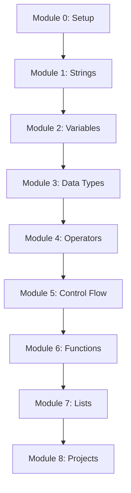

# Curriculum Map — Python for Pakistan (Madrasa + School)

Flexible timing: each **lesson** is one teaching block; combine or split as needed.

## Course outcomes (end of course)

Students will be able to:

1. Write and run simple Python programs in VS Code.
2. Use strings, variables, numbers, operators, conditions, loops, functions, and lists/dictionaries.
3. Solve small real-world problems using Pakistani and Islamic contexts.
4. Read error messages and fix common beginner mistakes.

---

## Module 0: Getting Started

| Lesson | Topics | Builds on |
|--------|--------|-----------|
| 0.1 | What is programming? Program vs calculator | — |
| 0.2 | VS Code + Python: open folder, run file | 0.1 |
| 0.3 | `print()`, first program | 0.2 |
| 0.4 | Comments, common errors | 0.3 |

**Checkpoint:** Student runs `print("Assalamu Alaikum")` without help.

---

## Module 1: Strings (no variables yet)

| Lesson | Topics | Builds on |
|--------|--------|-----------|
| 1.1 | String, quotes, concatenation, `len()` | 0 |
| 1.2 | Core methods: upper, lower, title, strip, replace | 1.1 |
| 1.3 | Escape sequences `\n`, `\t` | 1.1 |
| 1.4 | **Extension:** split, join, startswith, find (optional) | 1.2 |
| 1.5 | Practice + quiz | 1.1–1.3 |

**Checkpoint:** Student prints a formatted greeting using concatenation and one string method.

---

## Module 2: Variables & Input

| Lesson | Topics | Note |
|--------|--------|------|
| 2.1 | Assignment, naming, string variables | After strings |
| 2.2 | `input()`, storing text | 2.1 |
| 2.3 | `len()` with variables | 2.2 |

*Math operators and f-strings move to Modules 3–4 (no duplication).*

---

## Module 3: Data Types & Conversion

| Lesson | Topics |
|--------|--------|
| 3.1 | int, float, str, bool, `type()` |
| 3.2 | `int()`, `float()`, `str()` conversion |
| 3.3 | Common conversion errors |

---

## Module 4: Operators

| Lesson | Topics |
|--------|--------|
| 4.1 | Math operators `+ - * / // % **` |
| 4.2 | BODMAS, brackets |
| 4.3 | Comparison `== != < > <= >=` |
| 4.4 | Logical `and`, `or`, `not` |
| 4.5 | f-strings |

---

## Module 5: Control Flow

| Lesson | Topics |
|--------|--------|
| 5.1 | `if` |
| 5.2 | `if` / `else` |
| 5.3 | `elif` |
| 5.4 | `while` |
| 5.5 | `for` |

*Comparison/logical operators taught in Module 4; used here in conditions only.*

---

## Module 6: Functions

| Lesson | Topics |
|--------|--------|
| 6.1 | `def`, call, no parameters |
| 6.2 | Parameters |
| 6.3 | `return` |
| 6.4 | Default parameters |

---

## Module 7: Lists & Dictionaries

| Lesson | Topics |
|--------|--------|
| 7.1 | Lists, indexing |
| 7.2 | List methods, loops on lists |
| 7.3 | Tuples, sets (intro) |
| 7.4 | Dictionaries |
| 7.5 | Nested data (staged, simple first) |

---

## Module 8: Mini Projects (capstone)

| Project | Skills used |
|---------|-------------|
| Class attendance counter | variables, if, loops |
| Maktaba book list | strings, lists |
| Simple fee calculator | operators, input |
| Student name formatter | strings, methods |

---

## Concept dependency diagram

